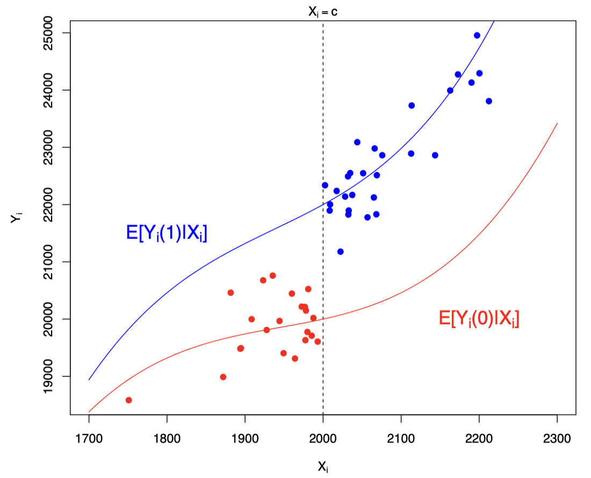
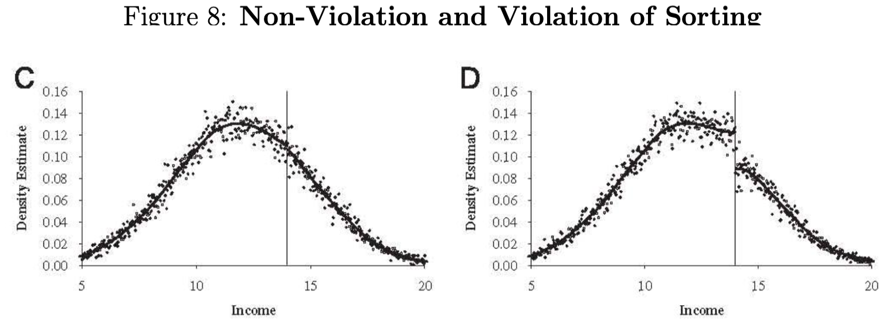

# Outline {background-color="#17a091"}

\newcommand\indep{\perp\!\!\!\perp}
\newcommand\nindep{\not\!\perp\!\!\!\perp}

\newcommand{\Cov}{\mathrm{Cov}}
\newcommand{\Var}{\mathrm{Var}}
\newcommand{\tr}{\mathrm{tr}}
\newcommand{\plim}{\operatornamewithlimits{plim}}
\newcommand{\diag}{\mathrm{diag}}
\newcommand{\E}{\mathrm{E}}
\newcommand{\Prob}{\mathrm{Prob}}
\newcommand{\bm}[1]{\boldsymbol{\mathbf{#1}}}

##

* Regression discontinuity design

  - Estimand
  - Assumptions
  - Estimation
  - Sharp
  - Fuzzy

# Regression Discontinuity Design


## What is a *discontinuity*?

We are interested in the causal effect of $D$ on $Y$

Assignment to *treatment* $D$ depends on the value of variable $X$

After a certain threshold value $c$ on variable $X$, treatment is assigned ($D = 1$)

. . .

Crucial assumption: People just below and just above the threshold are basically the same. Random processes put you just above or just below the threshold.

## What is a *discontinuity*?

There are two types of processes for assignment

**Sharp**: treatment is only and always assigned to everyone after $c$, never before that value

**Fuzzy**: treatment is more likely after $c$ than before but not 100%; some below $c$ do get treatment

## Examples of discontinuities

*What is the causal effect of receiving a Distinction for your university degree on income?*

. . .

Students who get a distinction are also different in other ways from students who do not get a distinction

. . .

Distinction is awarded above threshold $c$, e.g. in Oxford an average of 70

Nobody with average \<70 gets $D$, everyone with \>=70 gets $D$

. . .

What is the difference between a student with an average of 69 and a student averaging 70?

## Examples of discontinuities

*Do politicians use their office to enrich themselves?*

. . .

Earnings or wealth for former politicians and those from other careers is likely to be subject to
selection bias. 

. . .

Compare wealth at death for those who narrowly won their election to the
House of Commons to those who narrowly lost. Conservatives who narrowly won their elections died
on average almost £250,000 wealthier than candidates who narrowly failed (Eggers and Heinmueller).

. . .


How different are candidates with who got 49% of the votes versus 51%?

## Examples of discontinuities

*Does more education lead to better health?*

. . .

Individuals with more education are different in many other ways than just education compared to people with less education.

. . .

In year X, the mandatory schooling age increased from age 14 to 15. People born on August 31st could leave school at 14, those born a day latter had to stay in school for another year.

. . .

How different are children who are born 1 day apart?

. . .

Impossible for parents to influence reform

## Natural experiment / quasi-experimental

Around the discontinuity we assume random assignment

We need a deep understanding of the mechanisms that produce the threshold and assignment

## Running variable (aka forcing variable)

Score on the running (aka forcing) variable $X$ determines treatment $D$, which in turn affects $Y$

$X$ -\> $D$ -\> $Y$

Above threshold $c$ the probability of assignment to $X$ *suddenly* changes:

-   Sharp: below the threshold nobody receives the treatment, above the threshold everyone receives the treatment

-   Fuzzy: the probability of assignment jumps up at the threshold but the link/compliance is not perfect

## Sharp or Fuzzy

```{r}
#| echo: false

library(tidyverse)
runningvariable <- seq(1,100,1)
treatment_s <- ifelse(runningvariable>50, 1, 0)
noise <- rnorm(100, mean=0, sd=0.02)
treatment_f <- runningvariable/150 + noise
treatment_f <- ifelse(runningvariable>50, ((runningvariable/200+noise) + .5), treatment_f)
treatment_f <- ifelse(treatment_f<0, 0, treatment_f)
treatment_f <- ifelse(treatment_f>1, 1, treatment_f)
df <- as.data.frame(cbind(runningvariable, treatment_s, treatment_f))

```

<br>

:::: columns
::: {.column width="45%"}
```{r}
#| echo: false

ggplot(data = df, aes(x = runningvariable, y = treatment_s)) +
  geom_point(colour = "blue") +
  scale_x_continuous(name = "running variable (X)", limits =  c(0,100), breaks = c(0,50,100)) +
  scale_y_continuous(name = "proportion treated (D)", limits =  c(0,1), breaks = c(0,.5,1)) +
  theme_minimal() +
  theme(panel.grid.major = element_blank(), panel.grid.minor = element_blank()) +
  geom_vline(xintercept = 50, linetype = "dotted") +
  theme(text=element_text(size=25))

```
:::
::::

:::: columns
::: {.column width="45%"}
```{r}
#| echo: false

ggplot(data = df, aes(x = runningvariable, y = treatment_f)) +
  geom_point(colour = "darkblue") +
  scale_x_continuous(name = "running variable (x)", limits =  c(0,100), breaks = c(0,50,100)) +
  scale_y_continuous(name = "proportion treated (D)", limits =  c(0,1), breaks = c(0,.5,1)) +
  theme_minimal() +
  theme(panel.grid.major = element_blank(), panel.grid.minor = element_blank()) +
  geom_vline(xintercept = 50, linetype = "dotted") +
  theme(text=element_text(size=25))

```
:::
::::

. . .

[Here](https://tilburgsciencehub.com/topics/analyze/causal-inference/rdd/fuzzy-example/) is an example of a Fuzzy RDD in R. In this cases everyone below $c$ has $D=0$, but above $c$ likelihood of $D=1$ increases with $X$.

## Discontinuity in treatment

```{r}
#| echo: false

library(tidyverse)
x <- rnorm(1000, mean = 65, sd = 20)
x <- ifelse(x<0, 0, x)
x <- ifelse(x>100, x-30, x)
d <- ifelse(x>50, 1, 0)
noise <- rnorm(1000, mean=0, sd=20)
y <- 80 + 1.2*x + 0.5*d + 1.5*d*x + noise
df <- as.data.frame(cbind(y,x,d))
```

```{r}
#| echo: false

ggplot(data = df, aes(x=x, y=d, color = d)) +
  geom_jitter(height=0.1) +
  geom_vline(xintercept = 50) +
  theme(legend.position = "none") 
```

## Discontinuity in outcome

```{r}
#| echo: false

ggplot(data = df, aes(x=x, y=y, color = d)) +
  geom_point() +
  geom_vline(xintercept = 50) +
  theme(legend.position = "none") 
```

# Sharp RDD

## RDD and LATE

* **Treatment** $D_i \in \{0,1\}$
* **Threshold** $c$ above which $D_i = 1$
* **Potential outcomes** under Treatment and controlL $Y_i(1)$ and $Y_i(0)$
* **Running/forcing variable** $X_i$ that determines if $i$ is above/below $c$

$$
D_i =
\begin{cases}
1 & \text{if } X_i > c, \\
0 & \text{if } X_i \le c .
\end{cases}
$$
Then, LATE is defined **at the threshold c** as:

$$
\tau = E[Y_i(1)-Y_i(0)|X_i = c]
$$

## Continuity assumption



## Continuity and no manipulation assumption 

Potential outcomes should be continuous at the threshold $c$ in $X$

No jumps at $c$ for any other variables, only for $Y$ and $D$

. . .

A sufficient condition for this assumption is a lack of *perfect* manipulation

-   respondents can not manipulate *exactly* where on the score they end up (ie just below or just above threshold)

-   you can manipulate roughly where on a test score you end up (ie study hard), but you can not manipulate it by 1 point

## Other assumptions

* Continuity of POs

* No perfect manipulation of $X$

* Local SUTVA

* Sharp RD: Treatment assignment must change discontinuously at the cutoff

* Fuzzy RD: Exclusion restriction (here must be no “direct” effect of crossing ccc on the outcome.)

* Correct functional form is estimated locally

## In-class task: RDD contest (5mins) {background-color="#17a091"}

Think of your dissertation topic or some topic of interest

Can you think of an RDD in this context?

Discuss with your peer


## Checking the continuity assumption

1.  Plot observed variables against the threshold (running variable vs covariates: do we see a jump?)

2.  Are there any other discontinuities?

3.  Placebo discontinuity

4.  McCrary density test

## Density test around the cutoff



## Sharp Design in equations

Clear cutoff value for the running variable

-   $X < c$ : no treatment
-   $X >= c$ : treatment

$Y$ is a continuous outcome

$c$ is the threshold value

$D$ is a dummy for treatment (0/1)

$$Y = f(X) + \beta(X \ge c) + \epsilon$$ $$or$$ $$Y = f(X) + \beta D + \epsilon$$

## Sharp Design parametric

To shorten the equations: $\tilde{X} = X - c$

$$Y = \beta_0 + \beta_1D + \beta_2\tilde{X} + e$$

$$\beta_1 \text{ describes the treatment effect at threshold c}$$

. . .

We often estimate a more flexible model that allows different slopes left and right from the cutoff:

$$Y = \beta_0 + \beta_1D + \beta_2\tilde{X} + \beta_3\tilde{X}*D + e$$ Now $\beta_2$ is the slope of $X$ on the left and $(\beta_2+\beta_3)$ is the slope on the right.

. . .

If we think $f(X)$ is non-linear, e.g. quadratic, we add a functional form:

$$Y = \beta_0 + \beta_1D + \beta_2\tilde{X} + \beta_3\tilde{X}^2 + \beta_4\tilde{X}*D + \beta_5\tilde{X}^2*D + e$$

## $f(X)$ matters for the estimated gap

```{r}
#| echo: false

ggplot(data = df, aes(x=x, y=y, color = d)) +
  geom_point() +
  geom_smooth(data = filter(df, x <= 50), method = "lm", colour = "red") +
  geom_smooth(data = filter(df, x > 50), method = "lm", colour = "red") +
  geom_vline(xintercept = 50) +
  theme(legend.position = "none") 
```

## $f(X)$ LOESS instead of OLS

```{r}
#| echo: false

ggplot(data = df, aes(x=x, y=y, color = d)) +
  geom_point() +
  geom_smooth(data = filter(df, x <= 50), method = "loess", colour = "red") +
  geom_smooth(data = filter(df, x > 50), method = "loess", colour = "red") +
  geom_vline(xintercept = 50) +
  theme(legend.position = "none") 
```

## Bandwidth: the window around $c$

Our estimand is LATE around the threshold

. . .

-   What counts as *around*?

-   It matters who we include on either side of $c$

-   Further away: more cases, less clear it's an experiment

. . .

What is the right or optimal bandwidth: ad hoc/substantive vs data-driven approaches

## Non-parametric approaches

If we don't want to make assumptions about $f(X)$

Instead, an algorithm determines the shape based on the data:

-   locally weighted least squares
-   Kernel-weighted local polynomial smoothing
-   Smooths out the curves left and right, gives more weight to points closer to each other
-   Bandwidth still matters

. . .

After shaping the curves, compare the gap at the discontinuity. Compare the results of different approaches.

. . .

In R this can be done with the [rdrobust](https://rdpackages.github.io/) package

## Why should you be careful about $f(x)$:

```{r, echo = FALSE}
# simultate nonlinearity
dat <- tibble(
    x = rnorm(1000, 100, 50)
  ) %>% 
  mutate(
    x = case_when(x < 0 ~ 0, TRUE ~ x),
    D = case_when(x > 140 ~ 1, TRUE ~ 0),
    x2 = x*x,
    x3 = x*x*x,
    y3 = 10000 + 0 * D - 100 * x + x2 + rnorm(1000, 0, 1000)
  ) %>% 
  filter(x < 280)


ggplot(aes(x, y3, colour = factor(D)), data = dat) +
  geom_point(alpha = 0.2) +
  geom_vline(xintercept = 140, colour = "grey", linetype = 2) +
  stat_smooth(method = "lm", se = F) +
  labs(x = "Test score (X)", y = "Potential Outcome (Y)")
```


## An example

-   Credit: Andrew Heiss' *Program Evaluation* course, see [here](https://evalf20.classes.andrewheiss.com/example/rdd/)

-   Research question: *What is the causal effect of tutoring?*

-   What is our estimand?

```{r}

## Credit: Andrew Heiss
library(tidyverse)
library(broom)
library(rdrobust)
library(rddensity)
library(modelsummary)
tutoring <- read.csv("https://evalf20.classes.andrewheiss.com/data/tutoring_program.csv")
```

## Steps

1.  Is the discontinuity rule-based?

2.  Is the discontinuity sharp or fuzzy?

3.  Checking for manipulation

4.  Finding discontinuity in outcome

5.  Measuring the gap parametrically

6.  Measuring the gap non-parametrically

## Fuzzy or sharp?

```{r}
#| eval: true
#| echo: false

ggplot(tutoring, aes(x = entrance_exam, y = tutoring, color = tutoring)) +
  # Make points small and semi-transparent since there are lots of them
  geom_point(size = 1, alpha = 0.5, 
             position = position_jitter(width = 0, height = 0.25, seed = 1234)) + 
  # Add vertical line
  geom_vline(xintercept = 70) + 
  # Add labels
  labs(x = "Entrance exam score", y = "Participated in tutoring program") + 
  # Turn off the color legend, since it's redundant
  guides(color = FALSE)
```

## Fuzzy or sharp?

```{r}

tutoring %>% 
  group_by(tutoring, entrance_exam <= 70) %>% 
  summarize(count = n())
```

. . .

No non-compliers! This is sharp.

## Is there manipulation?

```{r}
#| echo: false

ggplot(tutoring, aes(x = entrance_exam, fill = tutoring)) +
  geom_histogram(binwidth = 2, color = "white", boundary = 70) + 
  geom_vline(xintercept = 70) + 
  labs(x = "Entrance exam score", y = "Count", 
       fill = "In program")
```

## Test for manipulation - McCrary test

```{r}
#| echo: TRUE

## test difference in estimated density functions at the cutoff 
test_density <- rddensity(tutoring$entrance_exam, c = 70)
summary(test_density)
```

## Test for manipulation - McCrary test

```{r}
#| echo: TRUE

plot_density_test <- rdplotdensity(rdd = test_density, 
                                   X = tutoring$entrance_exam, 
                                   type = "both")
```

## Is there a discontiniuty in the outcome?

-   Plot two lines, one for exam \<=70 and one for \>70
-   In sharp design, these Z and X are aligned (score \<=70 = tutoring)

```{r}
#| echo: false

ggplot(tutoring, aes(x = entrance_exam, y = exit_exam, color = tutoring)) +
  geom_point(size = 1, alpha = 0.5) + 
  # Add a line based on a linear model for the people scoring 70 or less
  geom_smooth(data = filter(tutoring, entrance_exam <= 70), method = "lm") +
  # Add a line based on a linear model for the people scoring more than 70
  geom_smooth(data = filter(tutoring, entrance_exam > 70), method = "lm") +
  geom_vline(xintercept = 70) +
  labs(x = "Entrance exam score", y = "Exit exam score", color = "Used tutoring")
```

## How big is the gap?

$$Y =  \beta_0 + \beta_1 (X-c) + \beta_2 D + \epsilon$$

$Y$ is final test score $X$ is entrance score $c$ is the cutt-off $D$ is the treatment (tutoring)

```{r}
#| eval: false
#| echo: true

lm(Y ~ X_centered + D, data = data)*
```

(\* Note Heiss does not include the interaction between $\hat{X}$ and $D$ in [his example](https://evalf20.classes.andrewheiss.com/example/rdd/#step-5-measure-the-size-of-the-effect) as in this particular case the models with and without are equivalent becasue the slopes left and right are similar)

## How big is the gap? Parametric

```{r}

tutoring_centered <- tutoring %>% 
  mutate(entrance_centered = entrance_exam - 70)

model_simple <- lm(exit_exam ~ entrance_centered + tutoring,
                   data = tutoring_centered)
tidy(model_simple)
```

## How big is the gap? What bandwidth?

```{r}
#| echo: true
model_bw_10 <- lm(exit_exam ~ entrance_centered + tutoring,
                  data = filter(tutoring_centered,
                                entrance_centered >= -10 & 
                                  entrance_centered <= 10))
tidy(model_bw_10)
```

## How big is the gap? What bandwidth?

```{r}
#| echo: true
model_bw_5 <- lm(exit_exam ~ entrance_centered + tutoring,
                  data = filter(tutoring_centered,
                                entrance_centered >= -5 & 
                                  entrance_centered <= 5))
tidy(model_bw_5)
```

## How big is the gap? What bandwidth?

```{r}

modelsummary(list("Full data" = model_simple, 
                  "Bandwidth = 10" = model_bw_10, 
                  "Bandwidth = 5" = model_bw_5))
```

## How big is the gap? Non-parametric

```{r}
#| echo: TRUE

rdrobust(y = tutoring$exit_exam, 
         x = tutoring$entrance_exam, c = 70) %>% 
summary()
```


## How sensitive are the results for bandwidth choice?

```{r, echo = FALSE}
x  <- tutoring$entrance_exam
y  <- tutoring$exit_exam
c0 <- 70
bw_grid <- seq(5, 50, by = 5)
results <- data.frame()

for (bw in bw_grid) {
  model <- rdrobust(
    y = y,
    x = x,
    c = c0,
    h = bw
  )
  
  results <- rbind(results, data.frame(
    bandwidth = bw,
    coef      = model$coef[1],
    se        = model$se[1],
    ci_low    = model$ci[1,1],
    ci_high   = model$ci[1,2]
  ))
}

# -------------------------------------------------------------
# Plot with ggplot2
# -------------------------------------------------------------
ggplot(results, aes(x = bandwidth, y = coef)) +
  geom_point(size = 2) +
  geom_line() +
  geom_errorbar(aes(ymin = ci_low, ymax = ci_high), width = 0.5) +
  theme_minimal(base_size = 14) +
  labs(
    title = "RDD Sensitivity to Bandwidth Choice",
    x = "Bandwidth (h)",
    y = "Treatment Effect Estimate"
  )
```

# Fuzzy RDD


## Fuzzy RDD

-   What if the threshold does not perfectly predict treatment?

-   But the running variable is a strong predictor of treatment and is random around the threshold

-   Sounds familiar...

. . .

-   We use the running variable and threshold $c$ as an IV

-   $X$ -\> $D$ -\> $Y$ (IV week: $Z$ -\> $T$ -\> $Y$)

. . .

-   2SLS as in IV

-   LATE for compliers at the threshold


## Sharp vs Fuzzy RD

A regression discontinuity setup has:

-   Running variable: `X`
-   Cutoff: `c`
-   Treatment indicator: `D`

Sharp RD:

-   `D = 1(X >= c)` exactly.

Fuzzy RD:

-   Probability of treatment jumps at `c`, but compliance is imperfect.
-   The cutoff indicator is an instrument for actual treatment near `c`.


## Fuzzy equations

$$\text{reduced form}$$

$$Y = f(X) + \beta_1(X \ge c) + \epsilon$$

<br><br>

$$\text{first stage}$$

$$D = f(X) + \beta_2(X \ge c) + \epsilon$$

$$\text{second stage}$$

$$Y = f(X) + \beta_3(\hat{D}) + \epsilon$$

## Identification in Fuzzy RD

At the cutoff, the parameter of interest is:

$$ \tau\_{FRD} = \frac{\lim_{x\downarrow c}E[Y|X=x]-\lim_{x\uparrow c}E[Y|X=x]}{\lim_{x\downarrow c}E[D|X=x]-\lim_{x\uparrow c}E[D|X=x]} $$

Interpretation:

-   Ratio of reduced-form jump in outcome to first-stage jump in treatment.
-   A local average treatment effect for **compliers at the cutoff**.


## R Setup

```{r}
# Install if needed:
# install.packages(c("rdrobust", "fixest", "ggplot2", "dplyr"))

library(rdrobust)
library(fixest)
library(ggplot2)
library(dplyr)
```

## Applied Example (Simulated Fuzzy RD)

```{r, echo = TRUE}
set.seed(2026)
n <- 3000

# Running variable and cutoff
x <- runif(n, -1, 1)
c0 <- 0
z <- as.integer(x >= c0)  # cutoff indicator (instrument)

# Imperfect compliance: treatment probability jumps at cutoff
p_treat <- pmin(pmax(0.25 + 0.40 * z + 0.20 * x, 0.02), 0.98)
d <- rbinom(n, 1, p_treat)

# Outcome with true causal effect of treatment = 2.0
y <- 1 + 2.0 * d + 1.2 * x + 0.6 * x^2 + rnorm(n, sd = 1)

frd_dat <- data.frame(y = y, d = d, x = x, z = z)
```

## Visual Check: Fuzzy First Stage

```{r, echo = TRUE}
# Plot binned means of d with local polynomial fits
rdrobust::rdplot(y = frd_dat$d, x = frd_dat$x, c = 0,
                 y.label = "Pr(treated)", x.label = "X")
```

## Visual Check: Reduced form for outcome

```{r, echo = TRUE}
# Plot binned means of y with local polynomial fits
rdrobust::rdplot(y = frd_dat$y, x = frd_dat$x, c = 0,
                 y.label = "Outcome", x.label = "X")
```
## Visual check: potential manipulation of x around the cutoff

```{r, eval=TRUE, warning = FALSE, echo = TRUE}
# Density manipulation test around cutoff
library(rddensity)
test_d <- rddensity(X = frd_dat$x, c = 0)
plot_density_test <- rdplotdensity(rdd = test_d, 
                                   X = frd_dat$x)
```

## Reduced form RD (not fuzzy yet)

```{r, echo = TRUE}
rf <- rdrobust(y = frd_dat$y, x = frd_dat$x, c = 0)
summary(rf)
```

## Estimation with `rdrobust` (Fuzzy)

```{r, echo = TRUE}
# Fuzzy RD: supply y, x, and fuzzy = treatment variable
a <- rdrobust(y = frd_dat$y, x = frd_dat$x, c = 0, fuzzy = frd_dat$d)
summary(a)
```

`a` includes:
-   Point estimate of local treatment effect at the cutoff
-   Robust standard error / confidence interval
-   MSE-optimal bandwidth choices

## Doing it with 2SLS using bandwidths

Idea: mimic FRD by restricting to observations near cutoff and instrumenting `d` with `z`.

```{r, echo = TRUE}
# Use the rdrobust bandwidth (left/right) to define a local sample
h_left <- a$bws[1, 1] ; h_right <- a$bws[1, 2]
local_dat <- frd_dat |>
  filter(x >= -h_left, x <= h_right) |>
  mutate(x_c = x, x_right = z * x_c)
iv_fit <- feols(y ~ x_c + x_right | d ~ z, data = local_dat)
modelsummary::msummary(list('second stage' = iv_fit, 'first stage' = iv_fit$iv_first_stage$d), stars = TRUE)
```

## Why This 2SLS Matches `rdrobust`` Intuition

-   `z = 1(x >= c)` is exogenous at the cutoff under RD assumptions.
-   First stage: `z` shifts treatment take-up (`d`) discontinuously.
-   Exclusion restriction: after controlling for local trends in `x`, `z` affects `y` only through `d`.
-   Second stage uses only local variation around `c`.
-   With local polynomial controls and small bandwidths, this targets the same local complier effect as fuzzy RD.

## Always check robustness to bandwidth selection

```{r}
x  <- frd_dat$x    # Running variable
y  <- frd_dat$y      # Outcome variable
z  <- frd_dat$d    # Treatment variable (for fuzzy RDD)
c0 <- 0         # Cutoff

# Sequence of bandwidths to test
bw_grid <- seq(0.1, 1, by = 0.1)

# -------------------------------------------------------------
# Run fuzzy rdrobust for each bandwidth and collect results
# -------------------------------------------------------------
results <- data.frame()

for (bw in bw_grid) {
  
  model <- rdrobust(
    y = y,
    x = x,
    fuzzy = z,   # Fuzzy RDD specification
    c = c0,
    h = bw
  )
  
  # model$coef[1] is the fuzzy Wald estimate (LATE)
  results <- rbind(results, data.frame(
    bandwidth = bw,
    coef      = model$coef[1],
    se        = model$se[1],
    ci_low    = model$ci[1,1],
    ci_high   = model$ci[1,2]
  ))
}

# -------------------------------------------------------------
# Plot using ggplot2
# -------------------------------------------------------------
ggplot(results, aes(x = bandwidth, y = coef)) +  geom_point(size = 2) +  
  geom_line() +  geom_errorbar(aes(ymin = ci_low, ymax = ci_high), width = 0.02) +  
  theme_minimal(base_size = 14) +  
  geom_hline(yintercept=0, linetype="dashed", 
                color = "red", size=2) +
  labs(    title = "Fuzzy RDD Sensitivity (estimated with rdrobust)",    
           x = "Bandwidth (b)",    y = "Fuzzy RDD Estimate (Wald LATE)"  )

```

## Practical Checklist for Fuzzy RD

-   Verify a clear first-stage jump at cutoff.
-   Use robust bias-corrected inference (`rdrobust`).
-   Report bandwidth and polynomial order.
-   Show sensitivity (alternative bandwidths / kernels).
-   Check manipulation of running variable (e.g. McCrary test via `rddensity`)
-   Peform placebo tests (use pre-treatment variables to check if there is discontinuity or significant RD effect)

## Takeaway

Fuzzy RD is an IV design in a neighborhood of the cutoff:

-   **Instrument:** crossing the threshold
-   **Treatment:** actual take-up
-   **Estimand:** local complier effect at the cutoff

`rdrobust` gives a principled default implementation, and local 2SLS makes the mechanics transparent.

