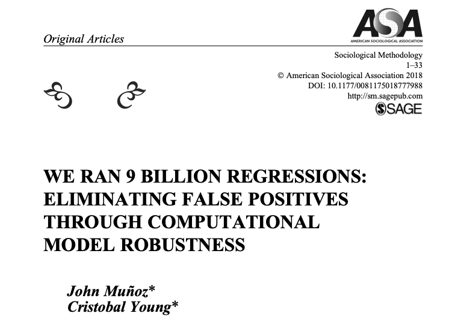
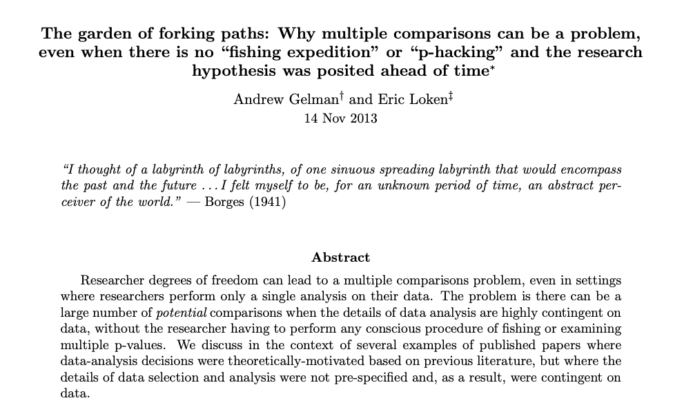
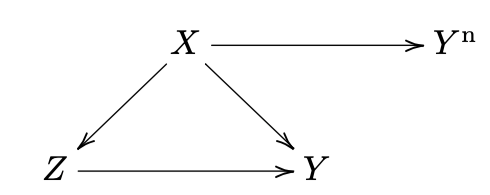
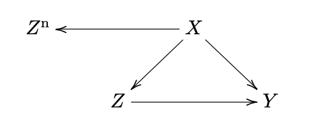
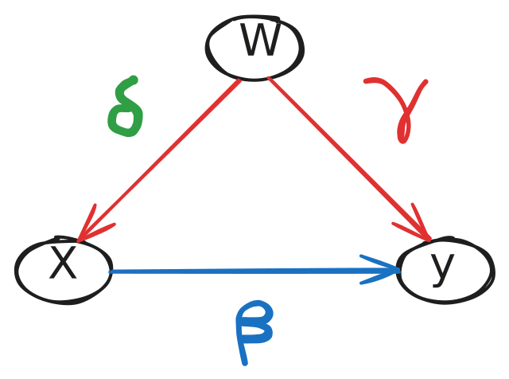
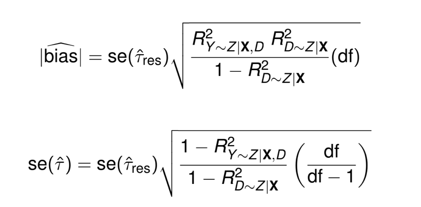
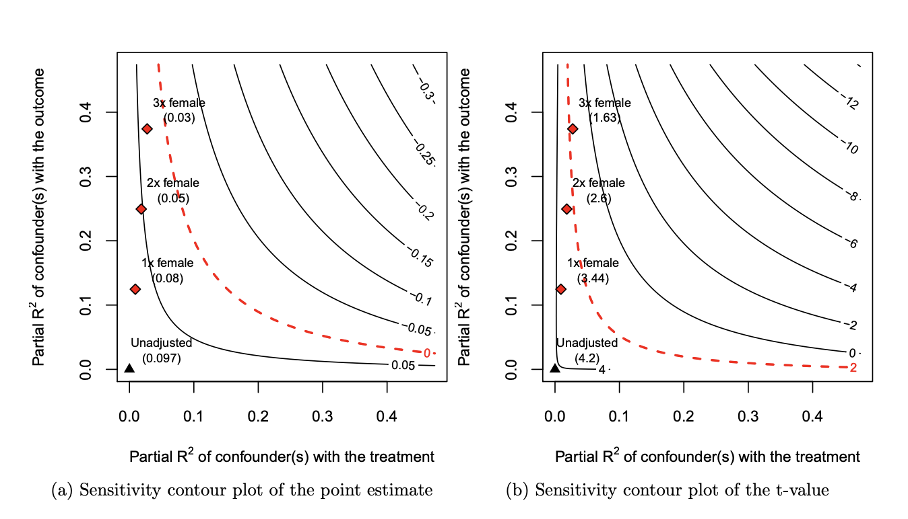
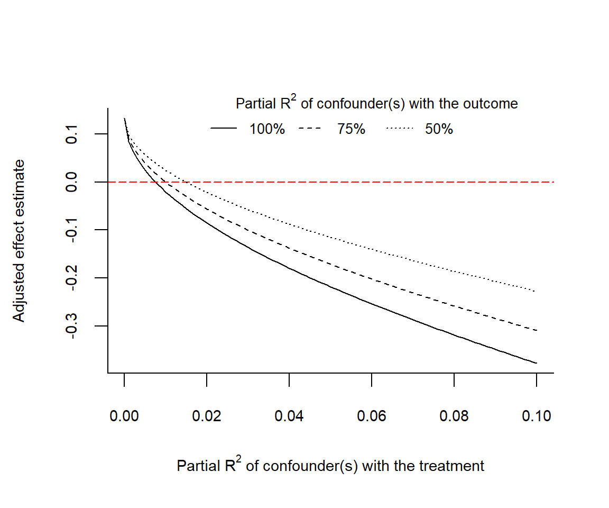

# Outline {background-color="#17a091"}

* Front-door criterion: identification through mechanisms

* Sensitivity: what to do with untestable assumptions?

* Feedback

\newcommand\indep{\perp\!\!\!\perp}
\newcommand\nindep{\not\!\perp\!\!\!\perp}

## Assessment feedback

* Generally PS1 reports were good
* $E[Y^T(D=C)]$ often estimable in RCT--also pay attention some POs can be observed (and estimable) under SUTVA!
* Define concepts when asked (e.g. basis set)
* Try to use equations we discussed in class as much as possible (e.g. $\delta_{naive}=\delta+selectionbias+differentialTEbias$) or precise language
* Study the exercises!! (e.g. tests of the basis set)
* In your own DAG: justify missing arrows too, provide a formal analysis of your own DAG
* Interpretation, interpretation, interpretation!

# Final mechanism for causal ID: front door {background-color="#17a091"}

## Causes of effects vs effects of causes

We have learned how to identify $X \rightarrow Y$

* Experiments (randomise $X$)
* Selection on observables (satisfy backdoor criterion via excessive control--regression, matching, weighting, Double Machine Learning)
* Difference-in-differences
* Natural experiments (Instrumental variables, regression discontinuity, synthetic control)

Those mostly identify **effects of causes**

Analytical sociology is about **mechanisms** $\approx$ **causes of effects**

* How do causal effects come about, through which mechanisms
* Macro-micro-macro aggegation (Headstrom 2005)
* Agent-based modelling and causal inference (Manzo 2022)
* Formal theoretical modelling (Coleman 1994)
* Qualitative process tracing (Varese 2024)

## Front-door criterion: where mechanisms meet causal identification

::: columns
::: {.column width="50%"}
Model 1: 
```{r, message=FALSE, echo = FALSE, fig.width=4, fig.height=2}
library(dagitty)

plot(dagitty('dag{ 
  D [pos="0,0"] 
  M [pos="1,0"] 
  U [pos="1,-1"] 
  Y [pos="2,0"] 
  D -> M; M -> Y; U -> {D Y};}'))
```
Can you identify $M \rightarrow Y$?

How about $D \rightarrow M$?

How about $D \rightarrow Y$?

:::

::: {.column width="50%"}

Model 2: 
```{r, message=FALSE, echo = FALSE, fig.width=4, fig.height=2}
plot(dagitty('dag{ 
  D [pos="0,0"]
  M [pos="1,-0.25"]
  N [pos="1,0.25"]
  U [pos="1,-1"]
  Y [pos="2,0"] 
  D -> M; M -> Y; D -> N; N -> Y; U -> {D Y};}'))
```
How about $D \rightarrow Y$ now?
:::
:::

## Front-door criterion

When $X$ have an unblocked backdoor path to $Y$, the causal effect $X \rightarrow Y$
is still identified by conditioning on a set of observed variables $\{M\}$ if

* **Condition 1 (exhaustiveness)**: The variables in $\{M\}$ intercepts **all** directed paths from $X$ to $Y$; and

* **Condition 2 (isolation)**: *(a)* **No** unblocked backdoor-paths connect $X$ to variables in $\{M\}$ and *(b)* **all** backdoor paths from the variables in $\{M \}$ on $Y$ can be blocked by contioning on $X$ 

## Front-door criterion is tough

::: columns
::: {.column width="50%"}
Model 1: 
```{r, message=FALSE, echo = FALSE, fig.width=4, fig.height=2}
library(dagitty)

plot(dagitty('dag{ 
  D [pos="0,0"] 
  M [pos="1,0"] 
  U [pos="1,-1"] 
  Y [pos="2,0"] 
  D -> M; M -> Y; U -> {D Y}; U -> M}'))
```
Is the front-door criterion satisfied here?

:::

::: {.column width="50%"}

Model 2: 
```{r, message=FALSE, echo = FALSE, fig.width=4, fig.height=2}
plot(dagitty('dag{ 
  D [pos="0,0"]
  M [pos="1,-0.25"]
  N [pos="1,0.25"]
  U [pos="1,-1"]
  Y [pos="2,0"] 
  D -> M; M -> Y; D -> N; N -> Y; U -> {D Y};}'))
```
Is the front-door criterion satisfied here if N is unobserved?
:::
:::

. . .

**If** you can find a setup in Sociology where front-door criterion is convincingly satisfied, you have a top paper already!


# Course feedback

* Give feedback on the course, help be understand the strengths of the module
as well as places to improve


{width=30%}

[Here is the same link](https://forms.cloud.microsoft/pages/responsepage.aspx?id=G96VzPWXk0-0uv5ouFLPkfVqTPEaufZAs46xUYI7U6xURjFYTTBXSEhHUldYNDVVR1MwRDhIU1UyNi4u&route=shorturl)

Write / talk to me as well if you have feedback


# Sensitivity: what to do with untestable assumptions? {background-color="#17a091"}

## Roadmap

* [Conceptual clarification]{.fragment .highlight-blue} 

  [robustness vs sensitivity]{.fragment .fade-in-then-out}

* [Assessing unconfoundedness]{.fragment .highlight-blue}
  
  [Negative outcomes]{.fragment .fade-in-then-out}
  [Negative treatments]{.fragment .fade-in-then-out}
  
* [Quantitative bias analysis]{.fragment .highlight-blue}

  [Assumption-free bounds (Manski)]{.fragment .fade-in-then-out}
  [Worst-case bounds (Rosenbaum)]{.fragment .fade-in-then-out}
  
  [R-value (Cinelli and Hazlett)]{.fragment .fade-in-then-out}
  
* [There is so much more out there!]{.fragment .highlight-blue}


# What is sensitivity analysis? {background-color="#17a091"}

## Credibility revolution: be clear about causal identification *and* open about the procedure through which results are obtained

:::{.r-stack}
{.fragment width="600" height="450"}

{.fragment width="600" height="600"}

{.fragment width="650" height="500"}
:::

## What to do with our assumptions?

During this course, we have seen that causal inference with observational data relies on [untestable assumptions]{.fragment .highlight-red}. But should we simply take them at face value?

In applied research, it is common to *"put to test"* one's approach and see how our results and findings change as a function of our decisions

. . .

  - Traditionally, a bunch of "robustness checks" relegated to the appendix
  
. . .

Researchers and methodologists are now paying increasing attention to this problem, and bringing it to the forefront. 

We need ways to measure the strength of the evidence our studies provide, accounting for the uncertainty in the assumptions we are invoking for our analyses!


## Sensitivity vs Robustness

Sensitivity and robustness are frequently used interchangeably, referring to how results would change (sensitivity) or not (robustness) when we make different analytical decisions.

I believe is good to separate two things:

* How *identification* results depend on *untestable* assumptions about the data generating process

* How *estimation* results depend on *analytical* or *statistical* decisions, like data recoding and model specification

. . .

To the first, we will call [*sensitivity*]{.fragment .highlight-blue}, i.e., how our results change as we relax or negate assumptions about potential outcomes or causal relationships

To the second, we will call [*robustness*]{.fragment .highlight-green}, i.e., how our results change as we modify the ways in which we analyse the data


# Assessing unconfoundedness {background-color="#17a091"}

## Negative outcomes

One possible way to assess if the unconfoundedness assumption holds is to assume we have a negative outcome ($Y^n$), similar in confounding structure to the outcome of interest ($Y$), but we know the treatment effect for $Y^n$.

A particular case, commonly invoked, is when we know $\tau(X \rightarrow Y^n) =0$



. . . 

**Examples**: 

- Cornfield et al. (1959) using $Smoking \rightarrow CarAccidents$

- Imbens and Rubin (2015) using $Exposure \rightarrow Y_{t-1}$

- Jackson et al. (2016) using $FluVaccine \rightarrow Health_{pre-season}$

## Negative treatments

Another way to assess if the uncounfoundedness assumption holds is to assume we have  negative exposure ($D^n$), similar in confounding structure to the outcome of interest ($Y$), but we know the treatment effect of $D^n$

A particular case, commonly invoked, is when we know $\tau(X \rightarrow Z^n) = 0$



. . . 

**Examples**:

- Sanderson et al. (2017) using $PaternalExposure \rightarrow Newborn < MaternalExposure \rightarrow Newborn$

## What have you notice?

All of these examples are highly non-trivial!

Applying these strategies require knowledge about the causal process (and causal graph), that we may not have.

# Quantitative bias analysis {background-color="#17a091"}

## Sensitivity Analysis (QBA)

A different approach is to, instead of trying to find a (lateral) "test" for our assumptions, simulate violations of such assumptions to a certain degree.

Obtaining a (range of) "bias-corrected" estimates gives us an idea of how fragile our inferences are.

Similar to the case with negative outcomes and negative treatments, we generally require to impose additional auxiliary assumptions for these analyses to work, or at least for being able to provide them with a useful interpretation.

There are two different ways of doing this:

* Start with the weakest possible assumptions (or no assumptions at all), and incrementally increase how strict your assumptions are: [bounding analysis]{.fragment .highlight-red}

* Start with the strongest possible assumption (you're willing to defend), and incrementally relax it until the estimated effect vanishes: [sensitivity analysis]{.fragment .highlight-red}

## Bounding / set identification / partial identification

$$
a + b = 10
$$

What is the value of $a$?

. . .

What is the possible range of $a$?

. . .

What is the range of $a$ if $0 \leq b \leq 10$

. . .

What is the range of $a$ if $5 \leq b \leq 7$


## Assumption-free bounds (Manski)

|     |$E[Y^1|.]$ |	$E[Y^0|.]$ |	   	
|-----|---------- |----------- |
| $E[\delta_{naive}]=0.4$ | | |
| Treatment group |  $E[Y^1|D=1] = 0.7$ | <span style="color:red;">$E[Y^0|D=1] =??$</span> |
| Control group | <span style="color:red;">$E[Y^1|D=0] =??$</span> |  $E[Y^0|D=0] = 0.3$ |

. . . 

| $E[\delta_{max}]=0.7$    |           |	           |	   	
|-----|---------- |----------- |
| Treatment |  $E[Y^1|D=1] = 0.7$ | <span style="color:red;">$E[Y^0|D=1] =0$</span> |
| Control | <span style="color:red;">$E[Y^1|D=0] =1$</span> |  $E[Y^0|D=0] = 0.3$ |

. . . 

|$E[\delta_{min}]=-0.3$ | | |
|-----|---------- |----------- |
| Treatment |  $E[Y^1|D=1] = 0.7$ | <span style="color:red;">$E[Y^0|D=1] =1$</span> |
| Control | <span style="color:red;">$E[Y^1|D=0] =0$</span> |  $E[Y^0|D=0] = 0.3$ |

Assumption free Manski bounds: $-0.3\leq \delta \leq 0.7$

## Weak assumptions (with $Pr(T)=0.5$)

Monotone treatment response bounds $\delta_i\geq 0$ 

. . .

$\delta_{min} = 0.5(0.7-\color{red}{0.7})+0.5(\color{red}{0.3}-0.3)=0$


$0\leq \delta \leq 0.7$

. . .

Monotone treatment selection bounds (treated always have larger POs than control)

. . .

$\delta_{max} = 0.5(0.7-\color{red}{0.3})+0.5(\color{red}{0.7}-0.3)=0.4$


$-0.3\leq \delta \leq 0.4$

. . .

Monotone treatment response **and** selection:

. . . 

$0\leq \delta \leq 0.4$


## Worst-case bound (Rosenbaum)

For **matching**, Rosenbaum (2002) proposed bounds based on a single sensitivity parameter: $\Gamma \geq 1$ measuring departures from unconfoundedness (what Rosenbaum calls "hidden bias")

Under unconfoundedness, two observationally equivalent units with $X_i=X_j$ have the same propensity score. Now, let's assume a binary unobserved confounder $U$ affecting their odds of being treated

$$
\frac{1}{\Gamma} \leq \frac{\pi_t}{(1-\pi_t)}\frac{(1-\pi_c)}{\pi_c} \leq \Gamma
$$

* For example: $\Gamma = 2$ means that the $t$ unit has twice the odds of being treated unit $j$. 

* Rosenbaum bounds assume an *infinite* effect on the outcome (that is $R^2_{Y \sim U|X}=1$), but that can be relaxed (two parameters version with $\Gamma$ and $\Lambda$)


## The OBV formula  {auto-animate=true}

::: {.columns}

::: {.column width="50%"}
***Regression***

::: {style="margin-top: 100px;"}
$$\color{grey}{Y_i =  \zeta + \color{red}{\tilde{\beta}} X_i + u_i}$$

$$
\tilde{\beta} = \frac{\text{Cov}(X_i , Y_i)}{\text{Var}(X_i)}
$$

$$
= \frac{\text{Cov}(X_i, \alpha + \beta X_i + \gamma W_i + \epsilon_i)}{\text{Var}(X_i)}
$$

$$
= \color{blue}{\beta} + \underbrace{\color{red}{\gamma}}_{\text{Impact}} \times \underbrace{\color{green}{\delta}}_{\text{Imbalance}}
$$
:::


:::

::: {.column width="50%"}
***Path diagram***


:::

:::


## R(obustness)-value (Cinelli and Hazlett)

{.fragment .center}

* **RV**: What percentage of the *residual* variance in $Y$ and $D$ would need to be explained by the omitted variable to nullify the effect?


## R(obustness)-value (Cinelli and Hazlett)

{.fragment .center}

## Extreme-value analysis (similar to Rosenbaum)

{width=50%}

Imagine $U$ explains 100%, 75%, 50%, of the residual variation in outcome; how strongly U needs to be related to treatment to nullify the estimated effect? 


# It was a joy! {background-color="#17a091"}